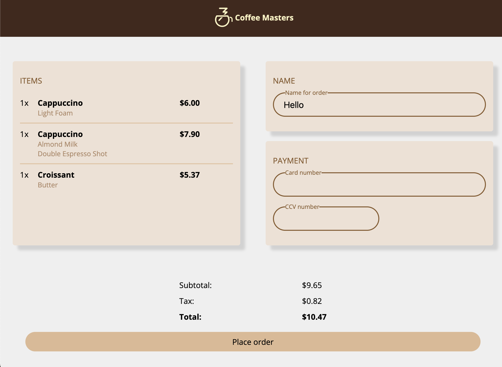

# Intro to Web Dev V3

## CSS Project

My solution to the CSS project from the Intro to Web Dev v3 course.

### Final Product

### Reflections

- I tried to use `grid` as much as possible in order to get more used to it since I don't have many opportunities to use it at work.

- I ended up overly relying on `div` elements and my usual CSS tricks (old habits die hard...)
