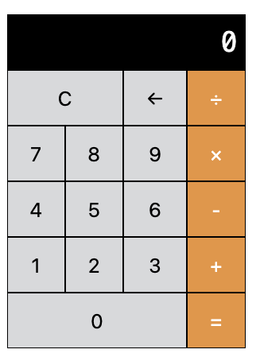

# Intro to Web Dev C3

## JS Project: Calculator

My solution to the JavaScript calculator project from the Intro to Web Dev v3 course.

### Final Product

[Video download](./calc_rec.mov)

### Task Requirements

[Requirement Page](https://btholt.github.io/complete-intro-to-web-dev-v3/lessons/putting-it-all-together/project)

### Reflections

Considering I'm already a frontend developer, that such a basic, beginner's task ended up being a bit of a challenge was a real wake up call. I was expecting to finish this task within an hour or so, but it ended up costing me a Saturday night filled with frustration. Some of the problem could have been due to me being tired, as here I am the next Sunday solving the problem in less than a half hour. Still, I feel my solution isn't the most efficient as my JS file ended up being pretty long for such a simple program. I look forward to seeing how the instructor wrote his JS to solve the task.
