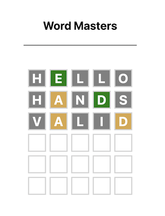

# Intro to Web Dev V3

## Final Project: Word Masters

My solution to the final project (a Wordle clone app) from the Intro to Web Dev v3 course.

### Final Product

### Task Requirements

[Requirement Page](https://btholt.github.io/complete-intro-to-web-dev-v3/lessons/talking-to-servers/project)

### Reflections

For many reasons, I felt very unmotivated to start this project. However, I am
glad that I did finally come back and work on it.

One thing I noticed is that when it comes to project planning and actually starting a project from scratch, I can freeze
up as I am not used to doing such things. At my job, I am usually bug fixing or building new feature in an already
existing application. So starting something from scratch, even a simple project like this, left me feeling uneasy.

This project isn't as complete as the sample project above, and it is in fact missing a fairly key feature where it may
not correctly label the right number of 'close' letters in your guess. It is something that I tested for, and all my tests
worked, however my testing was insufficient--I am sure--as I did nothing in code to guard against this situation. However,
I believe I got what was meant to be understood from this project, and now I just want to move on to the next shiny thing.
